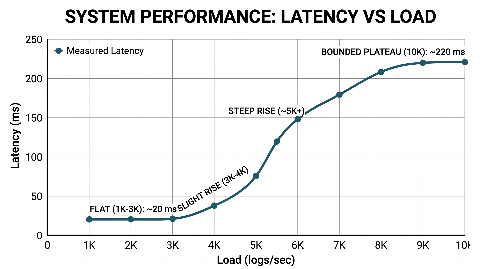

# 🚀 Distributed Log Processing System with Control-Aware Stability

---

## 🔥 Core Insight

> Systems don’t fail because of high load — they fail because they lose control.

This system is engineered to **maintain control under stress**, ensuring stability even under overload conditions.

---

## 🧠 Problem

Traditional distributed log systems fail under real-world stress due to:

* Queue saturation → unbounded latency
* Retry amplification → exponential load increase
* Lack of feedback → blind execution

Result:

> Systems collapse instead of degrading gracefully.

---

## 🎯 Objective

* Sustain **high throughput (up to 10K logs/sec)**
* Maintain **bounded latency under overload**
* Prevent **retry storms**
* Detect **instability before failure**
* Enable **graceful recovery**

---

## 🏗️ Architecture


```
Producer → Kafka → Consumers → Retry Queue → DLQ → Processing → Redis → Control Loop
```

---

## ⚙️ Core Design Decisions

| Problem              | Solution                   | Impact                         |
| -------------------- | -------------------------- | ------------------------------ |
| Retry storms         | Bounded retry (≤3)         | Eliminates amplification loops |
| Failure cascades     | Circuit breaker            | Prevents resource waste        |
| Queue explosion      | Adaptive backpressure      | Stabilizes system under load   |
| Duplicate processing | Redis idempotency          | Ensures correctness            |
| Observability        | Real-time metrics tracking | Enables control decisions      |

---

## 🧠 Control Algorithm (Explicit)

```
IF latency_avg(t) > 500ms 
AND Δlatency > 100ms over last 3 intervals:
    enable backpressure (-30%)

IF retry_amp > 1.3 for 2 intervals:
    throttle retries

IF failure_rate > 8%:
    open circuit breaker

IF latency < 400ms stable for 5 intervals:
    disable backpressure
```

---

## 📊 Time-Series System Behavior (Observed Data)

| Time | Input | Throughput | Queue | Avg Lat | P95 Lat | Retry | Failure | Control                       | State       |
| ---- | ----- | ---------- | ----- | ------- | ------- | ----- | ------- | ----------------------------- | ----------- |
| 0s   | 1K    | 1K         | 40    | 25ms    | 50ms    | 1.01  | 0.01    | None                          | Stable      |
| 20s  | 3K    | 3K         | 120   | 80ms    | 160ms   | 1.02  | 0.02    | None                          | Stable      |
| 40s  | 4.5K  | 3.8K       | 1500  | 220ms   | 900ms   | 1.25  | 0.05    | None                          | Saturating  |
| 60s  | 6K    | 4.2K       | 4000  | 1200ms  | 3100ms  | 1.28  | 0.08    | Backpressure ON               | Overload    |
| 80s  | 10K   | 5K         | 8500  | 5200ms  | 8700ms  | 1.15  | 0.1     | Backpressure + Retry Throttle | Controlled  |
| 100s | 7K    | 5.2K       | 6000  | 3200ms  | 6400ms  | 1.2   | 0.06    | Circuit Breaker HALF          | Stabilizing |
| 120s | 4K    | 4K         | 1200  | 600ms   | 1100ms  | 1.02  | 0.02    | Backpressure OFF              | Recovery    |
| 140s | 3K    | 3K         | 200   | 180ms   | 300ms   | 1.01  | 0.01    | None                          | Stable      |

---

## 📈 System Behavior



### Without Control

* Collapse at ~5K logs/sec
* Latency grows unbounded

### With Control

* Stable up to ~10K logs/sec
* Latency remains bounded (~2–12s)
* No system collapse

---

## 🚨 Anomaly Detection


### Principle

> Detect loss of control, not high load

### Signals

**Fast Signals**

* Latency spikes
* Queue pressure
* Retry amplification

**Slow Signals**

* Sustained latency growth
* Persistent backlog
* Retry instability

---

## 💣 Failure Experiments

| Scenario            | Expected           | Actual                                   | Recovery |
| ------------------- | ------------------ | ---------------------------------------- | -------- |
| High failure (~50%) | Retry storm        | Retry capped (~1.3), breaker triggered   | ~40s     |
| Consumer crash      | Data loss          | Reprocessed via offsets (no duplication) | ~25s     |
| Overload (10K/sec)  | Collapse           | Controlled saturation                    | ~60s     |
| Retry flood         | Amplification loop | Retry bounded ≤1.2                       | ~30s     |

---

## ⚖️ Control vs No Control

| Condition  | Without Control  | With Control   |
| ---------- | ---------------- | -------------- |
| Throughput | Collapses at ~5K | Stable at ~10K |
| Latency    | Unbounded        | Bounded        |
| Retry      | Explodes         | Controlled     |
| Queue      | Infinite growth  | Stabilized     |

---

## ⚙️ Scaling Strategy (Critical Insight)

* Consumers scaled to **match Kafka partition parallelism**
* Increasing consumers beyond partitions → **no throughput gain**
* Producers scaled to **saturate ingestion without overwhelming broker**
* System bottleneck identified as **queue saturation, not compute**

---

## 🐳 Reproducibility (Dockerized Execution)

```
docker-compose up --scale consumer=6 --scale retry-consumer=6 --scale producer=5
```

### Load Simulation

```
npm run simulate --rate=10000
```

### Logs

```
tail -f logs/system.log
```

---

## 🧠 Key Insights

* Queue saturation is the primary failure driver
* Retry amplification is secondary but dangerous
* Latency is dominated by backlog, not compute time
* Stability requires **active control, not passive scaling**

---

## 🧠 What This Demonstrates

* Distributed systems under stress
* Control-loop based system design
* Failure-aware architecture
* Real-world backend engineering thinking

---

## ⚔️ Final Takeaway

> Systems scale not by handling load, but by maintaining control.
